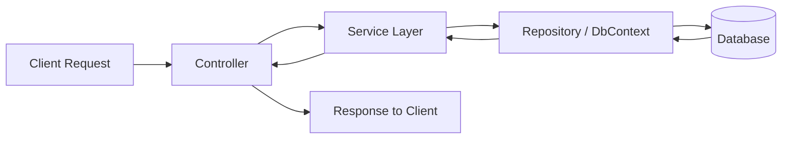
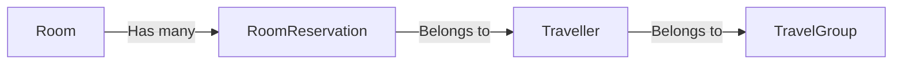

# Hotel App Services

This project implements a hotel room reservation API demonstrating a clean, scalable architecture with modern .NET practices, containerization, and CI/CD pipelines.

---

## Table of Contents

- [Project Overview](#project--overview)  
- [Architecture & Design](#architecture--design)
- [Architecture Diagram](#architecture--diagram)
- [Assumptions](#assumptions)
- [Getting Started](#getting-started)  
- [Configuration & Environment Variables](#configuration--environment-variables)  
- [Testing](#testing)  
- [Docker](#docker)  
- [CI/CD Pipeline](#cicd-pipeline)  
- [Future Improvements](#future-improvements)  
- [License](#license)

---

## Project Overview

This API allows management of hotel rooms and reservations. It provides endpoints to fetch room availability, manage bookings, and seed initial data. The project emphasizes clean code, testability, and deployment readiness.

---

## Architecture & Design

- **API Structure**:  
  - Layered architecture separating controllers, services, and data access.  
  - Uses DTOs to shape API responses and requests.  
  - Entity Framework Core with SQLite for persistence.

- **Docker**:  
  - Uses official Microsoft .NET SDK images for build and runtime.  
  - Environment variables are used to inject sensitive configs at runtime, following 12-factor app principles.

- **CI/CD Pipeline**:  
  - GitHub Actions workflow builds, restores, compiles, and runs tests on every commit and pull request.  
  - Ready to extend for container image publishing and cloud deployment.

- **Testing Strategy**:  
  - Unit tests for core business logic with mocked dependencies.  
  - Integration tests with in-memory or SQLite DB to validate API behavior end-to-end.

---

## Architecture Diagram

### API Workflow



### Entity Relationships



## Assumptions

- The API is designed to handle a small to medium-scale hotel reservation system.
- The database is SQLite for simplicity; in production, a more robust DB (e.g., SQL Server) should be used.
- The focus is on backend API functionality; UI and front-end clients are out of scope.
- Authentication and authorization are not implemented but assumed to be handled externally.
- Reservations are assumed to be daily-based (reservations handled as dates, not times).
- The CI/CD pipeline currently runs build and tests but does not deploy or publish images.

--some business logic assumptions --
- The API is designed with the assumption that it handles data for a single hotel.
- Multiple travelers from the same travel group can share a room, depending on the number of available beds.


## Getting Started

### Prerequisites

- [.NET SDK 8.0+](https://dotnet.microsoft.com/en-us/download)  
- [Docker](https://www.docker.com/get-started) (optional, for containerized builds)  

### Running Locally

```bash
git clone https://github.com/tejaswineekuder/hotel-app-services.git
cd hotel-app-services
dotnet restore hotel-app-services.sln
dotnet build hotel-app-services.sln
dotnet run --project HotelApi/HotelApi.csproj
```

The API will be available at http://localhost:8080.

## Configuration & Environment Variables

Default configuration is stored in appsettings.json.
Sensitive data such as connection strings should be provided via environment variables

```bash
export ConnectionStrings__DefaultConnection="Data Source=hotel.db"
```
This supports easy configuration override without rebuilding Docker images.

## Testing
Run unit and integration tests via CLI:

```bash
dotnet test HotelApi.Tests.Unit/HotelApi.Tests.Unit.csproj
dotnet test HotelApi.Tests.Integration/HotelApi.Tests.Integration.csproj
```
Tests are integrated into the CI pipeline for continuous verification.

## Docker
Build and run the Docker container:

```bash
docker build -t hotelapi .
docker run -p 8080:8080 hotelapi
```
The application listens on port 8080 inside the container.

##CI/CD Pipeline
GitHub Actions workflow (.github/workflows/ci-cd.yaml) automates build and testing on pushes and PRs.

Can be extended to publish Docker images to registries like DockerHub or Azure Container Registry.

## Future Improvements
- Add authentication and authorization layers.
- Enhance error handling and logging middleware.
- Implement end-to-end (e2e) tests with UI testing tools.
- Enhance validation handling.
- Deploy CI/CD pipeline to publish Docker images and automate deployments to Azure or other clouds.


